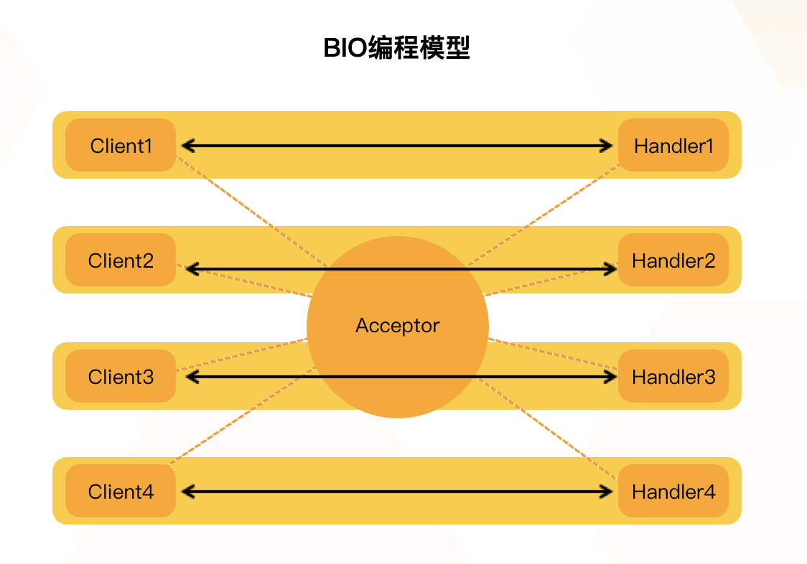
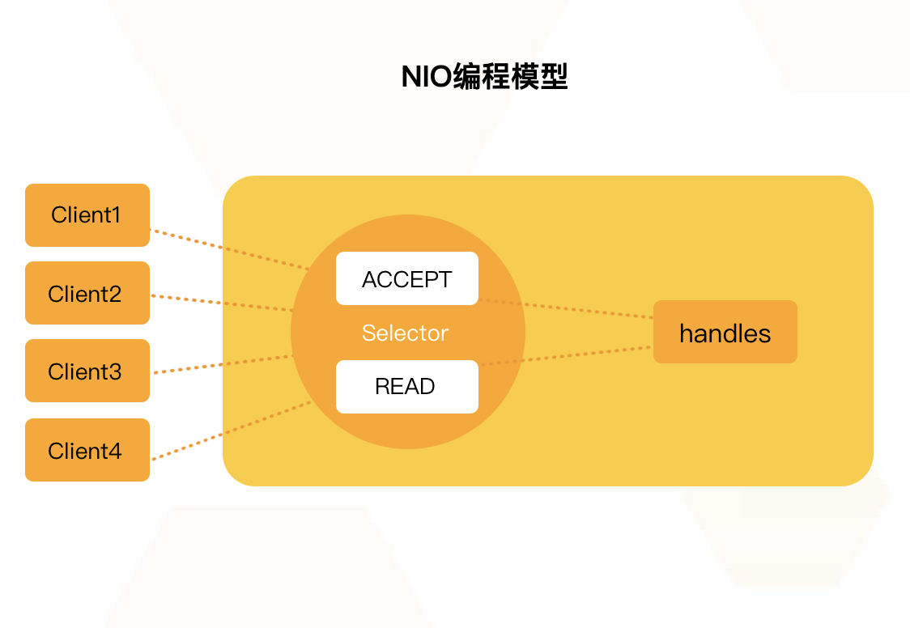

### Java I/O模型

#### BIO模型【同步阻塞IO】
BIO是同步阻塞模型，一个客户端连接对应一个处理线程。在BIO中，accept和read方法都是阻塞操作，如果没有连接请求，accept方法阻塞；如果无数据可读取，read方法阻塞。



```java
public void start() {

    try {
        // 绑定监听端口
        serverSocket = new ServerSocket(DEFAULT_PORT);
        System.out.println("启动服务器，监听端口：" + DEFAULT_PORT + "...");

        while (true) {
            // 等待客户端连接
            Socket socket = serverSocket.accept();
            // 创建ChatHandler线程
            new Thread(new ChatHandler(this, socket)).start();
        }

    } catch (IOException e) {
        e.printStackTrace();
    } finally {
        close();
    }
}
```

>存在问题：

对于服务端的程序，经常面对的是客户端传入的短小(执行时间短、工作内容较为单一) 任务，需要服务端快速处理并返回结果。如果服务端每次接受到一个任务，创建一个线程，然后进行执行，这在原型阶段是个不错的选择，但是面对成千上万的任务递交进服务器时，如果还是采用一个任务一个线程的方式，那么将会创建数以万记的线程，这不是一个好的选择。因为这会使操作系统频繁的进行线程上下文切换，无故增加系统的负载，而线程的创建和消亡都是需要耗费系统资源的，也无疑浪费了系统资源。


#### 伪异步IO模型【异步阻塞IO】

针对上面多线程的模型中，出现的线程重复创建、销毁带来的开销，可以采用线程池来优化。线程池技术能够很好地解决这个问题，它预先创建了若干数量的线程，并且不能由用户直接对线程的创建进行控制，在这个前提下重复使用固定或较为固定数目的线程来完成任务的执行。这样做的好处是，一方面，消除了频繁创建和消亡线程的系统资源开销，另一方面， 面对过量任务的提交能够平缓的劣化。

```java

    public void start() {

        try {
            // 绑定监听端口
            serverSocket = new ServerSocket(DEFAULT_PORT);
            System.out.println("启动服务器，监听端口：" + DEFAULT_PORT + "...");

            while (true) {
                // 等待客户端连接
                Socket socket = serverSocket.accept();
                // 创建ChatHandler线程
                executorService.execute(new ChatHandler(this, socket));
            }

        } catch (IOException e) {
            e.printStackTrace();
        } finally {
            close();
        }
    }
```

>存在问题：

在大量`短连接`的场景中性能会有提升，因为不用每次都创建和销毁线程，而是重用连接池中的线程。但在大量`长连接`的场景中，因为线程被连接长期占用，不需要频繁地创建和销毁线程，因而没有什么优势。虽然这种方法可以适用于小到中度规模的客户端的并发数，如果连接数超过 100,000或更多，那么性能将很不理想。


#### NIO模型【同步非阻塞模型】



"阻塞I/O+线程池"网络模型虽然比"阻塞I/O+多线程"网络模型在性能方面有提升，但这两种模型都存在一个共同的问题：读和写操作都是同步阻塞的,面对大并发（持续大量连接同时请求）的场景，需要消耗大量的线程来维持连接。CPU 在大量的线程之间频繁切换，性能损耗很大。一旦单机的连接超过1万，甚至达到几万的时候，服务器的性能会急剧下降。

而 NIO 的 Selector 却很好地解决了这个问题，用主线程（一个线程或者是 CPU 个数的线程）保持住所有的连接，管理和读取客户端连接的数据，将读取的数据交给后面的线程池处理，线程池处理完业务逻辑后，将结果交给主线程发送响应给客户端，少量的线程就可以处理大量连接的请求。

>NIO是同步非阻塞模型，服务端的一个线程可以处理多个请求，客户端发送的连接请求注册在多路复用器Selector上，服务端线程通过轮询多路复用器查看是否有IO请求，有则进行处理。

Java NIO 由以下几个核心部分组成：

- Buffer：用于存储数据，底层基于数组实现，针对8种基本类型提供了对应的缓冲区类。
- Channel：用于进行数据传输，面向缓冲区进行操作，支持双向传输，数据可以从Channel读取到Buffer中，也可以从Buffer写到Channel中。
- Selector：选择器，当向一个Selector中注册Channel后，Selector 内部的机制就可以自动不断地查询（Select）这些注册的Channel是否有已就绪的 I/O 事件（例如可读，可写，网络连接完成等），这样程序就可以很简单地使用一个线程高效地管理多个Channel，也可以说管理多个网络连接，因此，Selector也被称为多路复用器。当某个Channel上面发生了读或者写事件，这个Channel就处于就绪状态，会被Selector监听到，然后通过SelectionKeys可以获取就绪Channel的集合，进行后续的I/O操作。


[参考链接1](https://developer.aliyun.com/article/769813)

[参考链接2](https://waylau.gitbooks.io/essential-java/content/docs/io-model.html)

