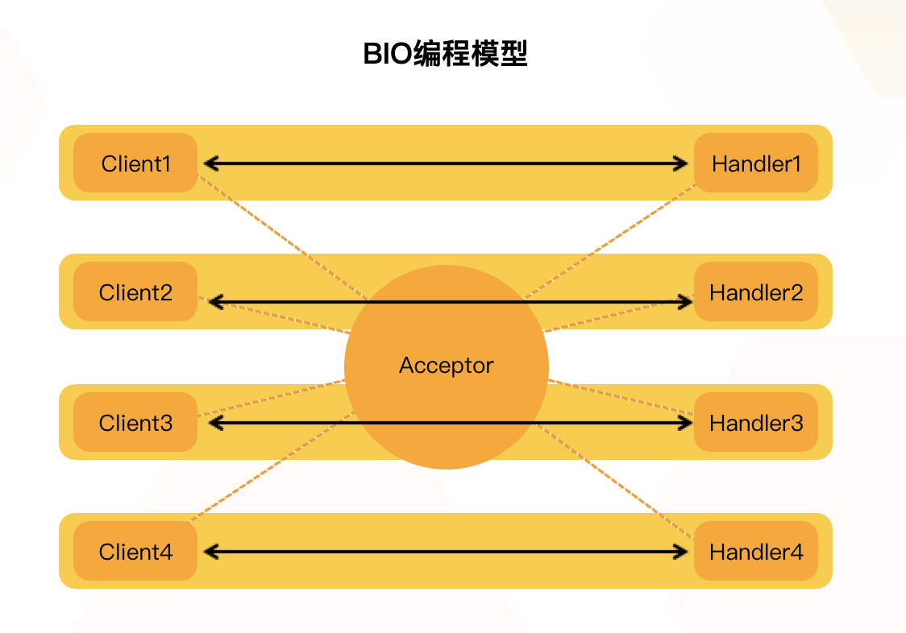
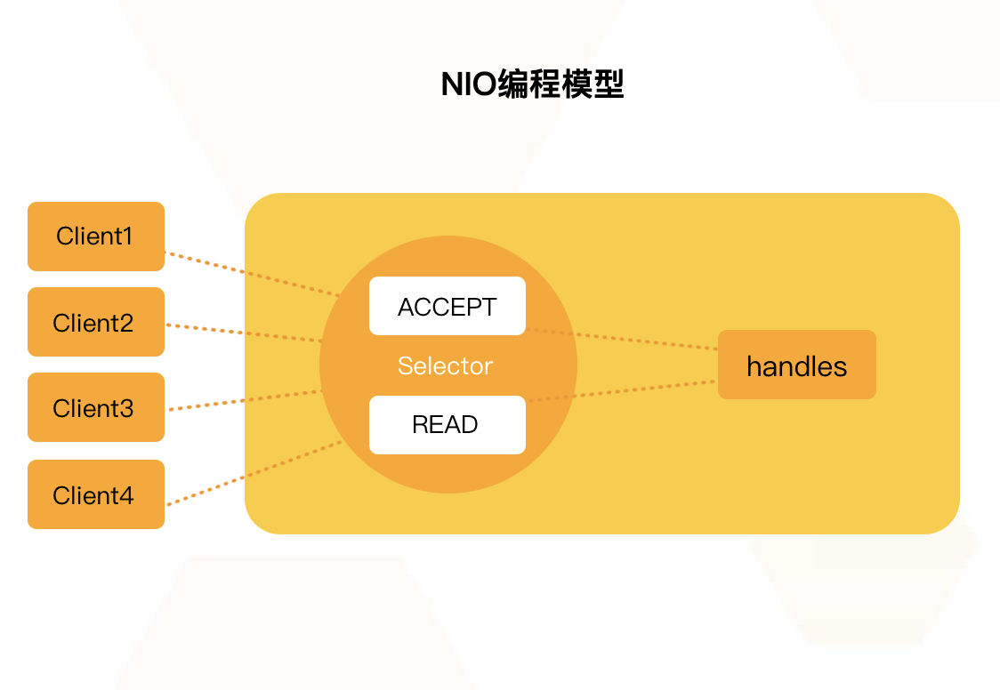
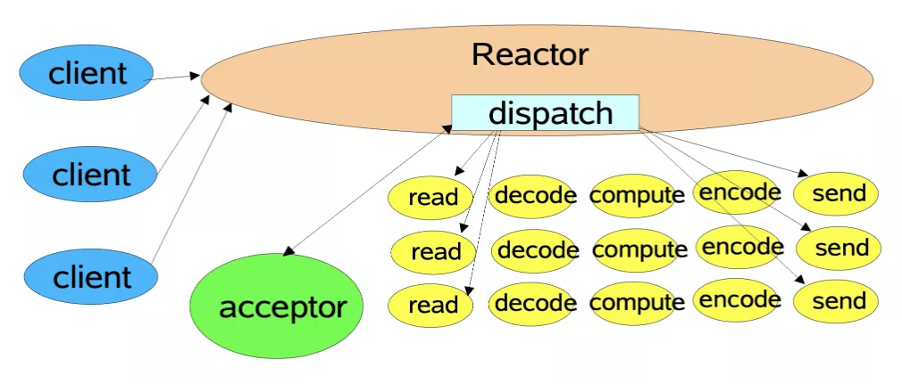
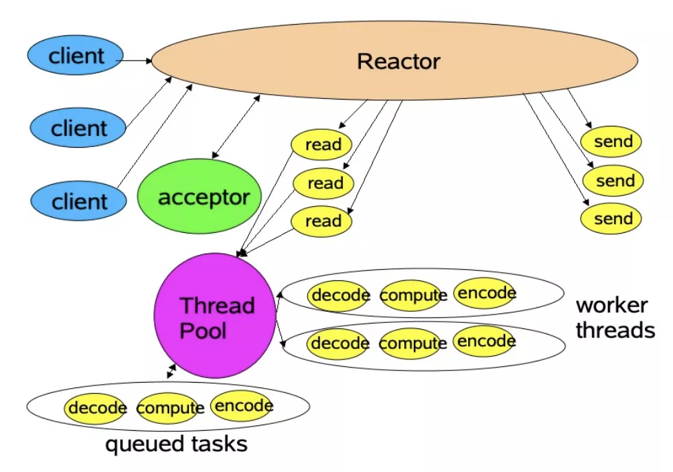
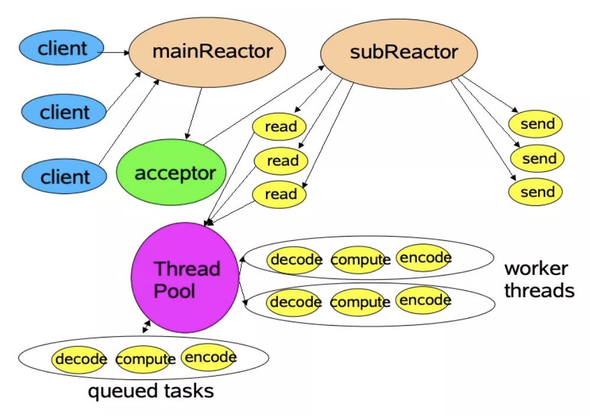
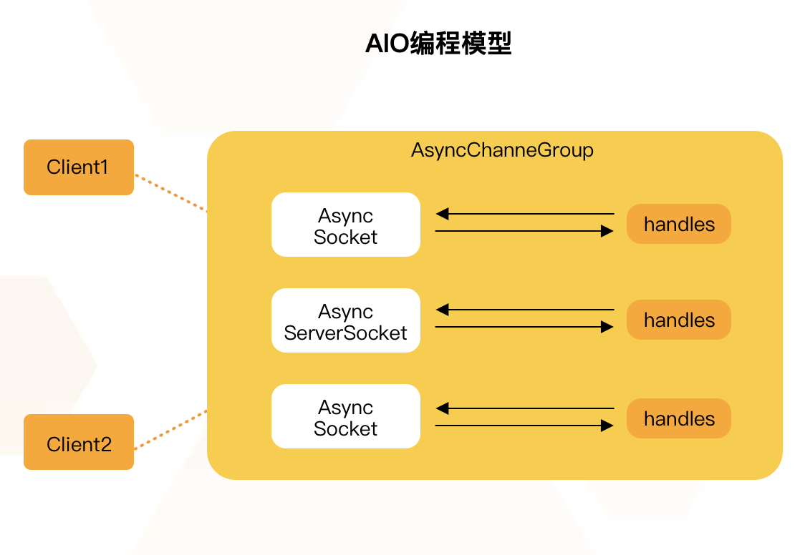

### I/O模型演进

#### BIO模型【同步阻塞IO】
BIO是传统I/O模型，一个客户端连接对应一个处理线程。在BIO中，accept和read方法都是阻塞操作，如果没有连接请求，accept方法阻塞；如果无数据可读取，read方法阻塞。



```java
public void start() {

    try {
        // 绑定监听端口
        serverSocket = new ServerSocket(DEFAULT_PORT);
        System.out.println("启动服务器，监听端口：" + DEFAULT_PORT + "...");

        while (true) {
            // 等待客户端连接
            Socket socket = serverSocket.accept();
            // 创建ChatHandler线程
            new Thread(new ChatHandler(this, socket)).start();
        }

    } catch (IOException e) {
        e.printStackTrace();
    } finally {
        close();
    }
}
```

>存在问题：

对于服务端的程序，经常面对的是客户端传入的短小(执行时间短、工作内容较为单一) 任务，需要服务端快速处理并返回结果。如果服务端每次接受到一个任务，创建一个线程，然后进行执行，这在原型阶段是个不错的选择，但是面对成千上万的任务递交进服务器时，如果还是采用一个任务一个线程的方式，那么将会创建数以万记的线程，这不是一个好的选择。因为这会使操作系统频繁的进行线程上下文切换，无故增加系统的负载，而线程的创建和消亡都是需要耗费系统资源的，也无疑浪费了系统资源。


#### 伪异步IO模型【异步阻塞IO】

针对上面多线程的模型中，出现的线程重复创建、销毁带来的开销，可以采用线程池来优化。线程池技术能够很好地解决这个问题，它预先创建了若干数量的线程，并且不能由用户直接对线程的创建进行控制，在这个前提下重复使用固定或较为固定数目的线程来完成任务的执行。这样做的好处是，一方面，消除了频繁创建和消亡线程的系统资源开销，另一方面， 面对过量任务的提交能够平缓的劣化。

```java

    public void start() {

        try {
            // 绑定监听端口
            serverSocket = new ServerSocket(DEFAULT_PORT);
            System.out.println("启动服务器，监听端口：" + DEFAULT_PORT + "...");

            while (true) {
                // 等待客户端连接
                Socket socket = serverSocket.accept();
                // 创建ChatHandler线程
                executorService.execute(new ChatHandler(this, socket));
            }

        } catch (IOException e) {
            e.printStackTrace();
        } finally {
            close();
        }
    }
```

>存在问题：

在大量`短连接`的场景中性能会有提升，因为不用每次都创建和销毁线程，而是重用连接池中的线程。但在大量`长连接`的场景中，因为线程被连接长期占用，不需要频繁地创建和销毁线程，因而没有什么优势。虽然这种方法可以适用于小到中度规模的客户端的并发数，如果连接数超过 100,000或更多，那么性能将很不理想。


#### NIO模型【同步非阻塞模型】



"阻塞I/O+线程池"网络模型虽然比"阻塞I/O+多线程"网络模型在性能方面有提升，但这两种模型都存在一个共同的问题：读和写操作都是同步阻塞的,面对大并发（持续大量连接同时请求）的场景，需要消耗大量的线程来维持连接。CPU 在大量的线程之间频繁切换，性能损耗很大。一旦单机的连接超过1万，甚至达到几万的时候，服务器的性能会急剧下降。

而 NIO 的 Selector 却很好地解决了这个问题，用主线程（一个线程或者是 CPU 个数的线程）保持住所有的连接，管理和读取客户端连接的数据，将读取的数据交给后面的线程池处理，线程池处理完业务逻辑后，将结果交给主线程发送响应给客户端，少量的线程就可以处理大量连接的请求。

>NIO是同步非阻塞模型，服务端的一个线程可以处理多个请求，客户端发送的连接请求注册在多路复用器Selector上，服务端线程通过轮询多路复用器查看是否有IO请求，有则进行处理。

Java NIO 由以下几个核心部分组成：

- Buffer：用于存储数据，底层基于数组实现，针对8种基本类型提供了对应的缓冲区类。
- Channel：用于进行数据传输，面向缓冲区进行操作，支持双向传输，数据可以从Channel读取到Buffer中，也可以从Buffer写到Channel中。
- Selector：选择器，当向一个Selector中注册Channel后，Selector 内部的机制就可以自动不断地查询（Select）这些注册的Channel是否有已就绪的 I/O 事件（例如可读，可写，网络连接完成等），这样程序就可以很简单地使用一个线程高效地管理多个Channel，也可以说管理多个网络连接，因此，Selector也被称为多路复用器。当某个Channel上面发生了读或者写事件，这个Channel就处于就绪状态，会被Selector监听到，然后通过SelectionKeys可以获取就绪Channel的集合，进行后续的I/O操作。
  
#### Reactor模型 -- 单线程模型 (单Reactor单线程)

Reactor内部通过Selector监控连接事件，收到事件后通过dispatch进行分发，如果是连接建立的事件，则由Acceptor处理，Acceptor通过accept接受连接，并创建一个Handler来处理连接后续的各种事件，如果是读写事件，直接调用连接对应的Handler来处理。

Handler完成read -> (decode -> compute -> encode) ->send的业务流程。

这种模型好处是简单，坏处却很明显，`当某个Handler阻塞时，会导致其他客户端的handler和accpetor都得不到执行`，无法做到高性能，只适用于业务处理非常快速的场景，如redis读写操作。



```java
/**
 * @description: 单线程 reactor 模式
 * <p>
 * reactor 和 handler 在一个线程里面
 * <p>
 * <p>
 * #####################################
 * reactor 模型各个组件
 * reactor: 负责响应事件，将事件分发给绑定了该事件的handler
 * handler: 绑定了某类事件的处理器， 负责执行对事件的处理
 * Acceptor: 特殊的Handler， 绑定了 connect 事件， 客户端的 connect 事件会分发给 Acceptor
 **/
public class SingleReactor implements Runnable {

    private Selector selector;
    private ServerSocketChannel serverSocket;

    public SingleReactor(int port) throws Exception {
        selector = Selector.open();
        serverSocket = ServerSocketChannel.open();
        serverSocket.socket().bind(new InetSocketAddress(port));
        // 设置成非阻塞
        serverSocket.configureBlocking(false);
        // 只关注 accept 事件
        SelectionKey selectionKey = serverSocket.register(selector, SelectionKey.OP_ACCEPT);
        // 注册 attach 对象
        selectionKey.attach(new Acceptor());
        System.out.println("Listen port:" + port);
    }

    @Override
    public void run() {
        try {
            while (!Thread.interrupted()) {
                selector.select(); // 阻塞至通道就绪
                Set<SelectionKey> selectionKeys = selector.selectedKeys(); // 就绪通道 SelectionKey 集合
                Iterator<SelectionKey> it = selectionKeys.iterator();
                // 遍历就绪事件，分发给对应处理器
                while (it.hasNext()) {
                    SelectionKey selectedKey = it.next();
                    dispatch(selectedKey);
                }
                // 清空就绪通道
                selectionKeys.clear();
            }
        } catch (IOException e) {
            e.printStackTrace();
        }
    }

    void dispatch(SelectionKey k) {
        // 获取 key 对应的处理器
        Runnable r = (Runnable) (k.attachment());
        if (r != null) {
            r.run();
        }
    }

    class Acceptor implements Runnable {
        @Override
        public void run() {
            try {
                // 接收连接，非阻塞模式没有连接直接返回null
                SocketChannel socket = serverSocket.accept();
                if (socket != null) {
                    socket.write(ByteBuffer.wrap("single reactor".getBytes()));
                    System.out.println("Accept and handler - " + socket.socket().getLocalSocketAddress());
                    // 分发给对应的 handler
                    new BasicHandler(selector, socket);
                }
            } catch (IOException ioex) {
                ioex.printStackTrace();
            }
        }
    }


    public static void main(String[] args) {
        try {
            Thread th = new Thread(new SingleReactor(10393));
            th.setName("SingleReactor");
            th.start();
            th.join();
        } catch (Exception e) {
            e.printStackTrace();
        }
    }
}
```

#### Reactor模型 -- 多线程模型 (单Reactor多线程)



主线程中，Reactor对象通过Selector监控连接事件,收到事件后通过dispatch进行分发，如果是连接建立事件，则由Acceptor处理，Acceptor通过accept接收连接，并创建一个Handler来处理后续事件，而Handler只负责响应事件，不进行业务操作，也就是只进行read读取数据和write写出数据，业务处理交给一个线程池进行处理。

线程池分配一个线程完成真正的业务处理，然后将响应结果交给主进程的Handler处理，Handler将结果send给client。

单Reactor承担所有事件的监听和响应，而当我们的服务端遇到大量的客户端同时进行连接，或者在请求连接时执行一些耗时操作，比如身份认证，权限检查等，这种瞬时的高并发就容易成为性能瓶颈。

```java
/**
 * @description: reactor 多线程模型
 * 为了匹配 CPU 和 IO 的速率，可设计多个 SingleReactor（即 Selector 池）
 * 主 Reacotr 负责监听连接，然后将连接注册到从 SingleReactor，将 I/O 转移了
 * 从 Reacotr 负责通道 I/O 的读写，处理器可选择单线程或线程池
 **/
public class MultiReactor {

    private int port;

    // SingleReactor 线程池大小
    private static final int POOL_SIZE = 3;
    // SingleReactor（Selector） 线程池，其中一个线程被 mainReactor 使用，剩余线程都被 subReactor 使用
    static Executor selectorPool = Executors.newFixedThreadPool(POOL_SIZE);

    // 主 SingleReactor，接收连接，把 SocketChannel 注册到从 SingleReactor 上
    private Reactor mainReactor;

    // 从 Reactors，用于处理 I/O，可使用 BasicHandler 和  MultithreadHandler 两种处理方式
    private Reactor[] subReactors = new Reactor[POOL_SIZE - 1];

    int next = 0;

    public MultiReactor(int port) {
        try {
             this.port = port;
            mainReactor = new Reactor();
            for (int i = 0; i < subReactors.length; i++) {
                subReactors[i] = new Reactor();
            }
        } catch (IOException e) {
            e.printStackTrace();
        }
    }

    /**
     * 启动主从 SingleReactor，初始化并注册 Acceptor 到主 SingleReactor
     */
    public void start() throws IOException {
        Thread mrThread = new Thread(mainReactor);
        mrThread.setName("mainReactor");
        new Acceptor(mainReactor.getSelector(), port); // 将 ServerSocketChannel 注册到 mainReactor

        selectorPool.execute(mrThread);

        for (int i = 0; i < subReactors.length; i++) {
            Thread srThread = new Thread(subReactors[i]);
            srThread.setName("subReactor-" + i);
            selectorPool.execute(srThread);
        }
    }

    class Acceptor implements Runnable {
        final Selector sel;
        final ServerSocketChannel serverSocket;

        public Acceptor(Selector sel, int port) throws IOException {
            this.sel = sel;
            serverSocket = ServerSocketChannel.open();
            serverSocket.socket().bind(new InetSocketAddress(port)); // 绑定端口
            // 设置成非阻塞模式
            serverSocket.configureBlocking(false);
            // 注册到 选择器 并设置处理 socket 连接事件
            SelectionKey sk = serverSocket.register(sel, SelectionKey.OP_ACCEPT);
            sk.attach(this);
            System.out.println("mainReactor-" + "Acceptor: Listening on port: " + port);
        }

        @Override
        public synchronized void run() {
            try {
                // 接收连接，非阻塞模式下，没有连接直接返回 null
                SocketChannel sc = serverSocket.accept();
                if (sc != null) {
                    // 把提示发到界面
                    sc.write(ByteBuffer.wrap("Implementation of Reactor Design Partten by tonwu.net\r\nreactor> ".getBytes()));

                    System.out.println("mainReactor-" + "Acceptor: " + sc.socket().getLocalSocketAddress() +" 注册到 subReactor-" + next);
                    // 将接收的连接注册到从 Reactor 上

                    // 发现无法直接注册，一直获取不到锁，这是由于 从 Reactor 目前正阻塞在 select() 方法上，此方法已经
                    // 锁定了 publicKeys（已注册的key)，直接注册会造成死锁

                    // 如何解决呢，直接调用 wakeup，有可能还没有注册成功又阻塞了。这是一个多线程同步的问题，可以借助队列进行处理
                    Reactor subReactor = subReactors[next];
                    subReactor.reigster(new BasicHandler(sc));
//					new MultithreadHandler(subSel, sc);
                    if(++next == subReactors.length) next = 0;
                }
            } catch (Exception ex) {
                ex.printStackTrace();
            }
        }
    }

    static class Reactor implements Runnable {
        private ConcurrentLinkedQueue<BasicHandler> events = new ConcurrentLinkedQueue<>();
        final Selector selector;
        public Reactor() throws IOException {
            selector = Selector.open();
        }
        public Selector getSelector() {
            return selector;
        }
        @Override
        public void run() { // normally in a new Thread
            try {
                while (!Thread.interrupted()) { // 死循环
                    BasicHandler handler = null;
                    while ((handler = events.poll()) != null) {
                        handler.socket.configureBlocking(false); // 设置非阻塞
                        // Optionally try first read now
                        handler.selectionKey = handler.socket.register(selector, SelectionKey.OP_READ); // 注册通道
                        handler.selectionKey.attach(handler); // 管理事件的处理程序
                    }

                    selector.select(); // 阻塞，直到有通道事件就绪
                    Set<SelectionKey> selected = selector.selectedKeys(); // 拿到就绪通道 SelectionKey 的集合
                    Iterator<SelectionKey> it = selected.iterator();
                    while (it.hasNext()) {
                        SelectionKey skTmp = it.next();
                        dispatch(skTmp); // 根据 key 的事件类型进行分发
                    }
                    selected.clear(); // 清空就绪通道的 key
                }
            } catch (IOException ex) {
                ex.printStackTrace();
            }
        }

        void dispatch(SelectionKey k) {
            Runnable r = (Runnable) (k.attachment()); // 拿到通道注册时附加的对象
            if (r != null) r.run();
        }

        void reigster(BasicHandler basicHandler) {
            events.offer(basicHandler);
            selector.wakeup();
        }

    }

}
```

#### 主从多线程模型 (多Reactor多线程)



存在多个Reactor，每个Reactor都有自己的Selector选择器，线程和dispatch。

主线程中的mainReactor通过自己的Selector监控连接建立事件，收到事件后通过Accpetor接收，将新的连接分配给某个子线程。

子线程中的subReactor将mainReactor分配的连接加入连接队列中通过自己的Selector进行监听，并创建一个Handler用于处理后续事件。

Handler完成read -> 业务处理 -> send的完整业务流程。


### AIO【NIO 2.0 异步非阻塞】



AIO是异步非阻塞模型，一般用于连接数较多且连接时间较长的应用，在读写事件完成后由回调服务去通知程序启动线程进行处理。与NIO不同，当进行读写操作时，只需直接调用read或write方法即可。这两种方法均为异步的，对于读操作而言，当有流可读取时，操作系统会将可读的流传入read方法的缓冲区，并通知应用程序；对于写操作而言，当操作系统将write方法传递的流写入完毕时，操作系统主动通知应用程序。可以理解为，read/write方法都是异步的，完成后会主动调用回调函数。


[参考链接1](https://developer.aliyun.com/article/769813)

[参考链接2](https://waylau.gitbooks.io/essential-java/content/docs/io-model.html)

