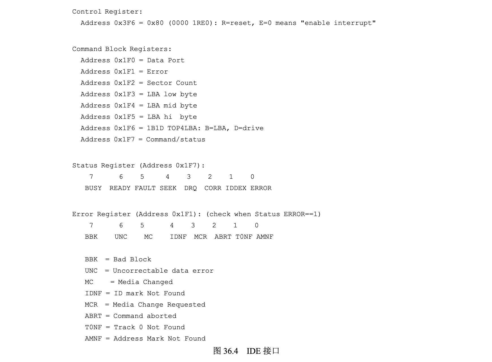
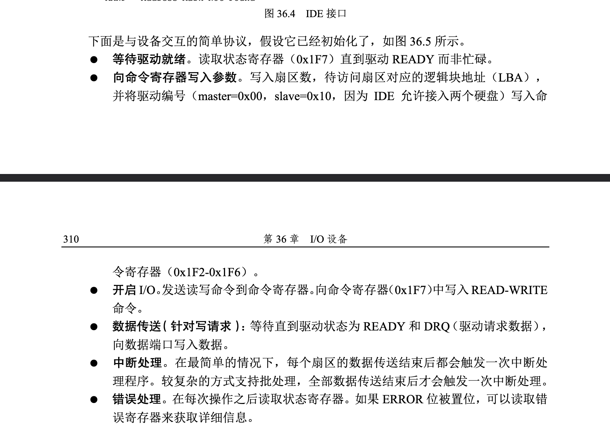
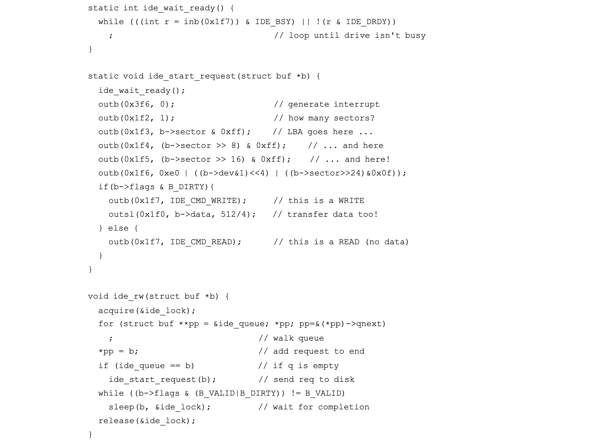
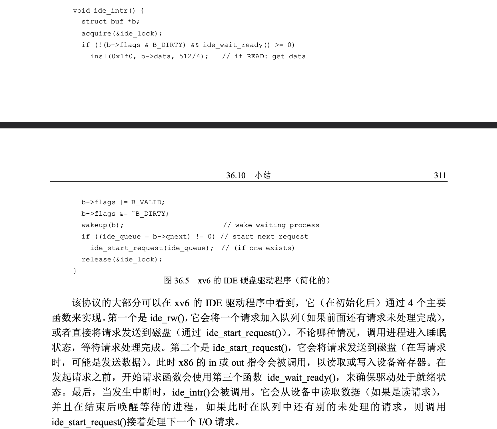

### IO设备

I/O对计算机系统非常重要。设想一个程序没有任何输入（每次运行总会产生相同的结果），或者一个程序没有任何输出（为什么要运行它？）。显而易见，为了让计算机系统更有趣，输入和输出都是需要的。因此，常见的问题如下。

> 如何与系统交互? IO应该如何集成进系统中？其中的一般机制是什么？如何让他们变得高效？

#### 系统架构

开始讨论之前，我们先看一个典型系统的架构:

1. CPU通过某种内存总线（memorybus）或互连电缆连接到系统内存。
2. 图像或者其他高性能I/O设备通过常规的I/O总线（I/Obus）连接到系统，在许多现代系统中会是PCI或它的衍生形式。
3. 最后，更下面是外围总线（peripheralbus），比如SCSI、SATA或者USB。它们将最慢的设备连接到系统，包括磁盘、鼠标及其他类似设备。

> 为何要这样分层架构？

简单回答：因为物理布局及造价成本。`越快的总线越短`，因此高性能的内存总线没有足够的空间连接太多设备。另外，在工程上高性能总线的造价非常高。所以，系统的设计采用了这种分层的方式，这样可以让要求高性能的设备（比如显卡）离CPU更近一些，低性能的设备离CPU远一些。将磁盘和其他低速设备连到外围总线的好处很多，`其中较为突出的好处就是你可以在外围总线上连接大量的设备`。

当然，现代系统越来越多地使用专门的芯片组和更快的点对点互连来提高性能。

现代系统架构显示了英特尔Z270芯片组的大致示意图，根据其架构，我们可以看到在顶部，CPU与内存系统连接最紧密，同时也与显卡(也就是显示器)有高性能连接，以支持游戏和其他图形密集型应用程序。

CPU通过英特尔专有DMI连接到I/O芯片，其余的设备通过许多不同的连接线（interconnects）连接到这个芯片。在右侧，一个或多个硬盘通过`eSATA接口`与系统相连；在图左侧，其他高性能设备则通过`PCIe`进行连接，在这个示意图中，我们可以看到网络接口以及其他高性能存储设备也在这连接。

#### 标准设备

现在来看一个标准设备（不是真实存在的），通过它来帮助我们更好地理解设备交互的机制。

可以看到一个包含两部分重要组件的设备。第一部分是`向系统其他部分展现的硬件接口`。同软件一样，硬件也需要一些接口，`让系统软件来控制它的操作`。因此，所有设备都有自己的特定接口以及典型交互的协议。

第二部分是内部结构：包含设备相关的特定实现，负责具体实现设备展示给系统的抽象接口。非常简单的设备通常用一个或几个芯片来实现它们的功能。更复杂的设备会包含简单的CPU、一些通用内存、设备相关的特定芯片，来完成它们的工作。

> I/O设备（CPU视角）: 一个能与CPU交换数据的接口/控制器。

#### 标准协议

一个（简化的）设备接口包含3个寄存器：
1. 一个`状态（status）寄存器`，可以读取并查看设备的当前状态；
2. 一个`命令（command）寄存器`，用于通知设备执行某个具体任务；
3. 一个`数据（data）寄存器`，将数据传给设备或从设备接收数据。

通过读写这些寄存器，操作系统可以控制设备的行为。我们现在来`描述操作系统与该设备的典型交互`，以便让设备为它做某事。协议如下：

该协议包含4步:

1. 操作系统通过反复读取状态寄存器，等待设备进入可以接收命令的就绪状态。我们称之为轮询（polling）设备（基本上，就是问它正在做什么）。
2. 操作系统下发数据到数据寄存器。例如，你可以想象如果这是一个磁盘，需要多次写入操作，将一个磁盘块（比如4KB）传递给设备。如果主CPU参与数据移动（就像这个示例协议一样），我们就称之为编程的I/O（programmedI/O，PIO）。
3. 操作系统将命令写入命令寄存器；这样设备就知道数据已经准备好了，它应该开始执行命令。
4. 最后一步，操作系统再次通过不断轮询设备，等待并判断设备是否执行完成命令（有可能得到一个指示成功或失败的错误码）

> 该协议存在哪些问题？

我们注意到这个协议存在的第一个问题就是`轮询过程比较低效，在等待设备执行完成命令时浪费大量CPU时间`，如果此时操作系统可以切换执行下一个就绪进程，就可以大大提高CPU的利用率。

> 如何减少轮询开销？操作系统检查设备状态时如何避免频繁轮询，从而降低管理设备的CPU开销？

#### 利用中断减少CPU开销

多年前，工程师们发明了我们目前已经很常见的中断（interrupt）来减少CPU开销。有了中断后，`CPU不再需要不断轮询设备，而是向设备发出一个请求，然后就可以让对应进程睡眠，切换执行其他任务。当设备完成了自身操作，会抛出一个硬件中断，引发CPU跳转执行操作系统预先定义好的中断服务例程`，或更为简单的中断处理程序。中断处理程序是一小段操作系统代码，它会结束之前的请求（比如从设备读取到了数据或者错误码）并且唤醒等待I/O的进程继续执行。

因此，中断允许计算与I/O重叠（overlap），这是提高CPU利用率的关键。下面的时间线展示了这一点：

其中，进程1在CPU上运行一段时间（对应CPU那一行上重复的1），然后发出一个读取数据的I/O请求给磁盘。`如果没有中断，那么操作系统就会简单自旋，不断轮询设备状态，直到设备完成I/O操作（对应其中的p）`。当设备完成请求的操作后，进程1又可以继续运行。如果我们利用中断并允许重叠，操作系统就可以在等待磁盘操作时做其他事情：

在这个例子中，在磁盘处理进程1的请求时，操作系统在CPU上运行进程2。磁盘处理完成后，触发一个中断，然后操作系统唤醒进程1继续运行。这样，在这段时间，无论CPU还是磁盘都可以有效地利用。

>注意，使用中断并非总是最佳方案。假如有一个非常高性能的设备，它处理请求很快：通常在CPU第一次轮询时就可以返回结果。此时如果使用中断，反而会使系统变慢：`切换到其他进程，处理中断，再切换回之前的进程代价不小`。因此，如果设备非常快，那么最好的办法反而是轮询。如果设备比较慢，那么采用允许发生重叠的中断更好。如果设备的速度未知，或者时快时慢，可以考虑使用混合（hybrid）策略，先尝试轮询一小段时间，如果设备没有完成操作，此时再使用中断。这种两阶段的办法可以实现两种方法的好处。 

> 总结：
`中断并非总是比PIO好`，尽管中断可以做到计算与I/O的重叠，但这`仅在慢速设备上有意义`。否则，`额外的中断处理和上下文切换的代价反而会超过其收益`。另外，如果短时间内出现大量的中断，可能会使得系统过载并且引发活锁。这种情况下，轮询的方式可以在操作系统自身的调度上提供更多的控制，反而更有效。

另一个`最好不要使用中断的场景是网络`。网络端收到大量数据包，如果每一个包都发生一次中断，那么有可能导致操作系统发生活锁，即不断处理中断而无法处理用户层的请求。

另一个基于中断的优化就是合并。设备在抛出中断之前往往会等待一小段时间，在此期间，其他请求可能很快完成，因此多次中断可以合并为一次中断抛出，从而降低处理中断的代价。当然，等待太长会增加请求的延迟，这是系统中常见的折中。

#### 利用 `DMA` 进行更高效的数据传送 

标准协议还有一点需要我们注意。具体来说，如果使用编程的I/O 将一大块数据传给设备，CPU 又会因为琐碎的任务而变得负载很重，浪费了时间和算力，本来这段时间可以更好用于运行其他进程。下面的时间线展示了这个问题：

进程1 在运行过程中需要向磁盘写一些数据，所以它开始进行I/O 操作，将数据从内存拷贝到磁盘（其中标示c 的过程）。拷贝结束后，磁盘上的I/O 操作开始执行，此时CPU 才可以处理其他请求。

> 关键问题：如何减少PIO 的开销 ? 使用 PIO 的方式，CPU 的时间会浪费在向设备传输数据或从设备传出数据的过程中。如何才能分
离这项工作，从而提高CPU 的利用率？

解决方案就是使用DMA（Direct Memory Access）。DMA 引擎是系统中的一个特殊设备，它可以协调完成内存和设备间的数据传递，不需要CPU 介入。 DMA 工作过程如下。为了能够将数据传送给设备，`操作系统会通过编程告诉DMA 引擎数据在内存的位置，要拷贝的大小以及要拷贝到哪个设备`。在此之后，操作系统就可以处理其他请求了。当DMA 的任务完成后，DMA 控制器会抛出一个中断来告诉操作系统自己已经完成数据传输。修改后的时间线如下：

从时间线中可以看到，数据的拷贝工作都是由 DMA 控制器来完成的。因为 CPU 在此时是空闲的，所以操作系统可以让它做一些其他事情，比如此处调度进程2 到CPU 来运行。因此进程2 在进程1 再次运行之前可以使用更多的CPU。

#### 设备交互的方法

> 关键问题：如何与设备通信 ? 硬件如何如与设备通信？是否需要一些明确的指令？或者其他的方式？

随着技术的不断发展，主要有两种方式来实现与设备的交互。

##### 方式一：设备标准协议
第一种办法相对老一些（在 IBM 主机中使用了多年），就是用明确的 I/O 指令。这些指令规定了操作系统将数据发送到特定设备寄存器的方法，从而允许构造上文提到的协议。 

例如在x86 上，in 和out 指令可以用来与设备进行交互。当需要发送数据给设备时，调用者指定一个存入数据的特定寄存器及一个代表设备的特定端口。执行这个指令就可以实现期望的行为。 这些指令通常是特权指令（privileged）。操作系统是唯一可以直接与设备交互的实体。例如，设想如果任意程序都可以直接读写磁盘：完全混乱（总是会这样），因为任何用户程序都可以利用这个漏洞来取得计算机的全部控制权。 

##### 方式二：内存映射I/O
第二种方法是内存映射I/O（memory- mapped I/O）。通过这种方式，硬件将设备寄存器作为内存地址提供。当需要访问设备寄存器时，操作系统装载（读取）或者存入（写入）到该内存地址；然后硬件会将装载/存入转移到设备上，而不是物理内存。 

两种方法没有一种具备极大的优势。内存映射I/O 的好处是不需要引入新指令来实现设备交互，但两种方法今天都在使用。

#### 纳入操作系统：设备驱动程序

最后我们要讨论一个问题：`每个设备都有非常具体的接口，如何将它们纳入操作系统`，而我们希望操作系统尽可能通用。例如文件系统，我们希望开发一个文件系统可以工作在SCSI 硬盘、IDE 硬盘、USB 钥匙串设备等设备之上，并且希望这个文件系统不那么清楚对这些不同设备发出读写请求的全部细节。因此，我们的问题如下: 

> 关键问题：如何实现一个设备无关的操作系统? 如何保持操作系统的大部分与设备无关，从而对操作系统的主要子系统隐藏设备交互的细节？

这个问题可以通过古老的抽象（abstraction）技术来解决。在最底层，操作系统的一部分软件清楚地知道设备如何工作，我们将这部分软件称为设备驱动程序（device driver），所有设备交互的细节都封装在其中。 我们来看看 Linux 文件系统栈，理解抽象技术如何应用于操作系统的设计和实现。下面的图粗略地展示了Linux 软件的组织方式。可以看出，文件系统（当然也包括在其之上的应用程序）完全不清楚它使用的是什么类型的磁盘。它只需要简单地向通用块设备层发送读写请求即可，块设备层会将这些请求路由给对应的设备驱动，然后设备驱动来完成真正的底层操作。尽管比较简单，但图展示了这些细节如何对操作系统的大部分进行隐藏。

注意，这种封装也有不足的地方。例如，如果有一个设备可以提供很多特殊的功能，但为了兼容大多数操作系统它不得不提供一个通用的接口，这样就使得自身的特殊功能无法使用。这种情况在使用SCSI 设备的Linux 中就发生了。SCSI 设备提供非常丰富的报告错误信息，但其他的块设（比如 ATA/IDE ）只提供非常简单的报错处理，这样上层的所有软件只能在出错时收到一个通用的EIO 错误码（一般IO 错误），SCSI 可能提供的所有附加信息都不能报告给文件系统。

#### 案例研究：简单的 IDE 磁盘驱动程序 

为了更深入地了解设备驱动，我们快速看看一个真实的设备——IDE 磁盘驱动程序
 

