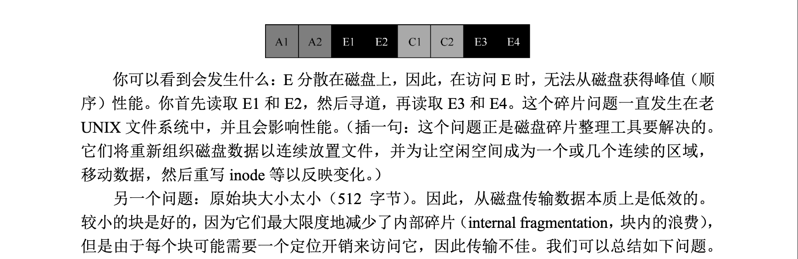
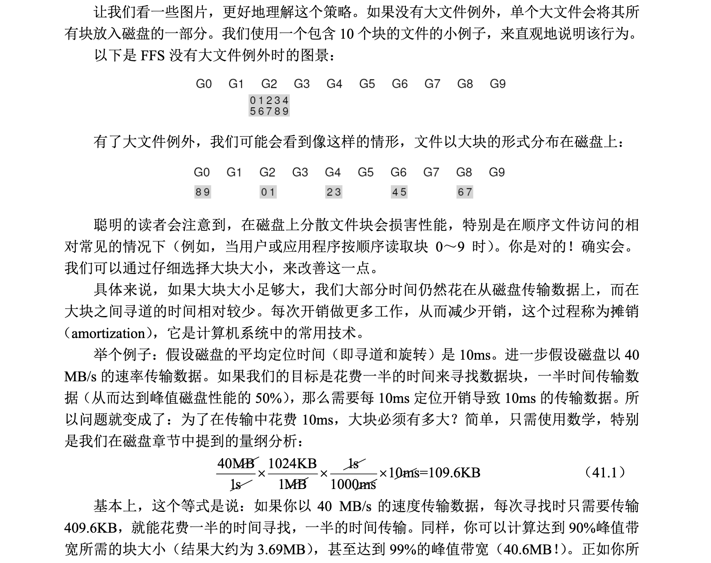

### 文件系统存在的问题

当UNIX 操作系统首次引入时，UNIX“魔法师”Ken Thompson 编写了第一个文件系统。我们称之为“老UNIX 文件系统”，它非常简单，基本上，它的数据结构在磁盘上看起来像这样:

超级块(S) 包含整个文件系统的信息：卷的大小，有多少node，指向空闲列表块的头部的指针等等。磁盘的inode区域包含文进系统的所有inode。最后的大部分磁盘都被数据块占用。

#### 存在的问题

主要存在的问题是老UNIX文件系统将磁盘当成随机内存读取。数据遍布各处，且不考虑保存数据的介质是磁盘的事实，因此具有实实在在的、昂贵的定位成本。

例如，文件的数据块通常离其inode非常远，因此每当第一次读取inode 然后读取文件的数据块（非常常见的操作）时，就会导致昂贵的寻道。

更糟糕的是，文件系统最终会变的非常碎片化，因为空闲空间没有得到精心管理。空闲列表最终会指向遍布磁盘的一堆块，并且随着文件的分配，它们只会占用下一个空闲块。结果是在磁盘上来回访问逻辑上连续的文件，从而大大降低了性能。

因此我们可以简单总结一下：

磁盘碎片化，导致同一份数据保存多个不连续的数据块，造成不必要的寻道操作。

### 关键问题:如何组织磁盘数据以提高性能 

> 如何组织文件系统数据结构以提高性能？在这些数据结构之上，需要哪些类型的分配策略？如何让
文件系统具有“磁盘意识”？

#### FFS：磁盘意识是解决方案

伯克利的一个小组决定建立一个更好、更快的文件系统，他们聪明地称之为快速文件系统（Fast File System，FFS）。思路是让文件系统的结构和分配策略具有“磁盘意识”，从而提高性能，这正是他们所做的。因此，FFS 进入了文件系统研究的新时代。通过保持与文件系统相同的接口（相同的API，包括 open()、read()、write()、close()和其他文件系统调用，
但改变内部实现，作者为新文件系统的构建铺平了道路，这方面的工作今天仍在继续。事实上，所有现代文件系统都遵循现有的接口（从而保持与应用程序的兼容性），同时为了性能、可靠性或其他原因，改变其内部实现。

#### 组织结构：柱面组

> 考虑在创建文件时必须更新哪些数据结构

对于这个例子，假设用户创建了一个新文件`/foo/bar.txt`，并且该文件长度为一个块（4KB）。

- 该文件是新的，因此需要一个新的 inode。因此，inode位图和新分配的inode都将写入磁盘。
- 该文件中还包含数据，因此也必须分配。因此（最终）将数据位图和数据块写入磁盘。
- 在创建新文件时，我们还必须将文件放在文件系统层次结构中。因此，必须更新目录。
- 具体来说，必须更新父目录foo，以添加bar.txt 的条目。此更新可能放入foo 现有的数据块，或者需要分配新块（包括关联的数据位图）。还必须更新foo 的inode，以反映目录的新长度以及更新时间字段（例如最后修改时间）

#### 策略：如何分配文件和目录 

> 有了这个分组结构，FFS 现在必须决定，如何在磁盘上放置文件和目录以及相关的元数据，以提高性能。基本的原理很简单：相关的东西放一起。

因此，为了遵守规则，FFS 必须决定什么是`相关的`，并将它们置于同一个区块组内。相反，不相关的东西应该放在不同的块组中。为实现这一目标，FFS 使用了一些简单的放置推断方法。

- 目录的放置

FFS 采用了一种简单的方法：找到分配数量少的柱面组（因为我们希望跨组平衡目录）和大量的自由 inode（因为我们希望随后能够分配一堆文件），并将目录数据和inode 放在该分组中。当然，这里可以使用其他推断方法（例如，考虑空闲数据块的数量）。

> 不是很理解 ？

- 文件

首先，它确保（在一般情况下）将`文件的数据块分配`到`与其inode 相同的组中`，从而防止inode和数据之间的长时间寻道。

其次，它将位于同一目录中的所有文件，放在它们所在目录的柱面组中。因此，如果用户创建了4个文件，/dir1/1.txt、/dir1/2.txt、/dir1/3.txt 和/dir99/4.txt，FFS 会尝试`将前3个放在一起（同一组）`，与第四个远离（它在另外某个组中）。

#### 大文件

在 FFS 中，文件放置的一般策略有一个重要的例外，它出现在大文件中。如果`没有不同的规则，大文件将填满它首先放入的块组（也可能填满其他组）`。以这种方式填充块组是不符合需要的，因为它妨碍了随后的“相关”文件放置在该块组内，因此可能破坏文件访问的局部性。

> 那关于大文件？怎么处理呢

因此，对于大文件，FFS 执行以下操作。在将一定数量的块分配到第一个块组（例如，12 个块，或inode 中可用的直接指针的数量）之后，FFS 将文件的下一个“大”块（即第一个间接块指向的那些部分）放在另一个块组中（可能因为它的利用率低而选择）。然后，文件的下一个块放在另一个不同的块组中，依此类推：

FFS 没有使用这种类型的计算来跨组分布大文件。相反，它采用了一种简单的方法，基于inode 本身的结构。前12 个直接块与inode 放在同一组中。每个后续的间接块，以及它指向的所有块都放在不同的组中。如果块大小为4KB，磁盘地址是32 位，则此策略意味着文件的每1024个块（4MB）放在单独的组中，唯一的例外是直接指针所指向的文件的前48KB。

