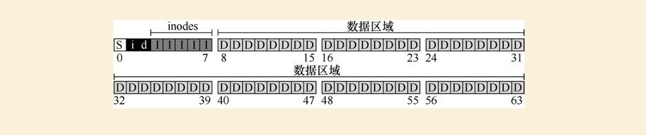
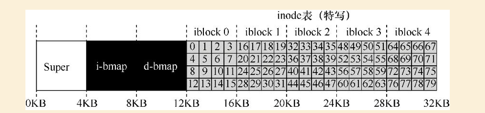

### 如何实现简单的文件系统

如何构建一个简单的文件系统？磁盘上需要什么数据结构？他们需要记录什么？它们如何访问？

### 思考方式

第一个方面是文件系统的数据结构。换言之，文件系统在磁盘上使用哪些类型的结构来组织其数据和元数据？文件系统的第二个方面是访问方法。如何将进程发出的调用，如open()、read()、write()等，映射到它的结构上？在执行特定的系统调用期间读取哪些结构？改写哪些结构？所有这些步骤的执行效率如何？如果你理解了文件系统的数据结构和访问方法，就形成了一个关于它如何工作的良好心智模型，这是系统思维的一个关键部分。

### 整体组织

我们现在来开发VSFS文件系统在磁盘上的数据结构的整体组织。

我们需要做的第一件事是将磁盘分成块。简单的文件系统只使用一种块大小，这里正是这样做的。我们选择常用的4KB。假设我们我们有一个非常小的磁盘，只有64块：

现在让我们考虑一下，为了构建文件系统，需要在这些块中存储什么。当然，首先想到的是用户数据。实际上，任何文件系统中的大多数空间都是（并且应该是）用户数据。我们将用于存放用户数据的磁盘区域称为数据区域，简单起见，将磁盘的固定部分留给这些块，例如磁盘上64个块的最后56个:

文件系统必须记录每个文件的信息。该信息是元数据（metadata）的关键部分，并且记录诸如文件包含哪些数据块（在数据区域中）、文件的大小，其所有者和访问权限、访问和修改时间以及其他类似信息的事情。为了存储这些信息，文件系统通常有一个名为inode的结构.

为了存放inode，我们还需要在磁盘上留出一些空间。我们将这部分磁盘称为inode表（inodetable），它只是保存了一个磁盘上inode的数组。因此，假设我们将64个块中的5块用于inode，磁盘映像现在看起来如下：

在这里应该指出，inode通常不是那么大，例如，只有128或256字节。假设每个inode有256字节，一个4KB块可以容纳16个inode，而我们上面的文件系统则包含80个inode。在我们简单的文件系统中，建立在一个小小的64块分区上，这个数字表示文件系统中可以拥有的最大文件数量。

到目前为止，我们的文件系统有了数据块（D）和inode（I），但还缺一些东西。你可能已经猜到，还需要某种方法来`记录inode或数据块是空闲还是已分配`。因此，这种分配结构（allocationstructure）是所有文件系统中必需的部分。当然，可能有许多分配记录方法。例如，我们可以用一个空闲列表（freelist），指向第一个空闲块，然后它又指向下一个空闲块，依此类推。我们选择一种简单而流行的结构，称为位图（bitmap），一种用于数据区域（数据位图，databitmap），另一种用于inode表（inode位图，inodebitmap）。位图是一种简单的结构：每个位用于指示相应的对象/块是空闲（0）还是正在使用（1）。因此新的磁盘布局如下，包含inode位图（i）和数据位图（d）：

细心的读者可能已经注意到，在极简文件系统的磁盘结构设计中，还有一块。我们将它保留给超级块（superblock），在下图中用S表示。超级块包含关于该特定文件系统的信息，包括例如文件系统中有多少个inode和数据块（在这个例子中分别为80和56）、inode表的开始位置（块3）等等。它可能还包括一些幻数，来标识文件系统类型（在本例中为VSFS）。因此，在挂载文件系统时，操作系统将首先读取超级块，初始化各种参数，然后将该卷添加到文件系统树中。当卷中的文件被访问时，系统就会知道在哪里查找所需的磁盘上的结构。

### 文件组织：inode

`文件系统最重要的磁盘结构之一是inode，几乎所有的文件系统都有类似的结构。`

每个inode都由一个数字（称为inumber）隐式引用，我们之前称之为文件的低级名称（lowlevelname）。
在VSFS（和其他简单的文件系统）中，给定一个inumber，你应该能够直接计算磁盘上相应节点的位置。例如，如上所述，获取VSFS的inode表：`大小为20KB（5个4KB块），因此由80个inode（假设每个inode为256字节）组成`。进一步假设inode区域从12KB开始（即超级块从0KB开始，inode位图在4KB地址，数据位图在8KB，因此inode表紧随其后）。因此，在VSFS中，我们为文件系统分区的开头提供了以下布局（特写视图）：

> 20KB * 1024 / 256 = 80 个 inode

要读取inode号32，文件系统首先会计算inode区域的偏移量（32×inode的大小，即8192），将它加上磁盘inode表的起始地址（inodeStartAddr=12KB），从而得到希望的inode块的正确字节地址：20KB。

> (20KB * 1024 + 8192)/1024 = 20kB

### 多级索引

