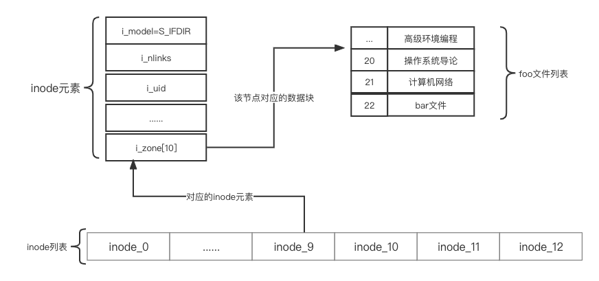
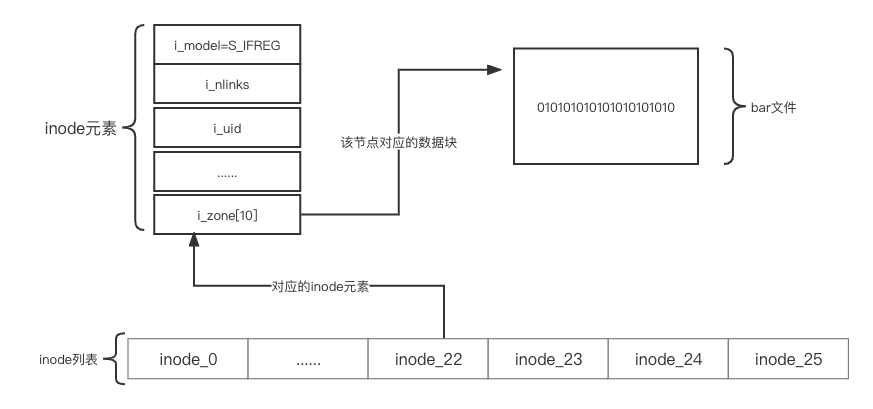

### 如何实现简单的文件系统

如何构建一个简单的文件系统？磁盘上需要什么数据结构？他们需要记录什么？它们如何访问？

### 思考方式

第一个方面是文件系统的数据结构。换言之，文件系统在磁盘上使用哪些类型的结构来组织其数据和元数据？文件系统的第二个方面是访问方法。如何将进程发出的调用，如open()、read()、write()等，映射到它的结构上？在执行特定的系统调用期间读取哪些结构？改写哪些结构？所有这些步骤的执行效率如何？如果你理解了文件系统的数据结构和访问方法，就形成了一个关于它如何工作的良好心智模型，这是系统思维的一个关键部分。

### 整体组织

我们现在来开发VSFS文件系统在磁盘上的数据结构的整体组织。

我们需要做的第一件事是将磁盘分成块。简单的文件系统只使用一种块大小，这里正是这样做的。我们选择常用的4KB。假设我们我们有一个非常小的磁盘，只有64块：


现在让我们考虑一下，为了构建文件系统，需要在这些块中存储什么。当然，首先想到的是用户数据。实际上，任何文件系统中的大多数空间都是（并且应该是）用户数据。我们将用于存放用户数据的磁盘区域称为数据区域，简单起见，将磁盘的固定部分留给这些块，例如磁盘上64个块的最后56个:


文件系统必须记录每个文件的信息。该信息是元数据（metadata）的关键部分，并且记录诸如`文件包含哪些数据块（在数据区域中）、文件的大小，其所有者和访问权限、访问和修改时间以及其他类似信息`的事情。为了存储这些信息，文件系统通常有一个名为inode的结构.

为了存放inode，我们还需要在磁盘上留出一些空间。我们将这部分磁盘称为inode表（inodetable），它只是保存了一个磁盘上inode的数组。因此，假设我们将64个块中的5块用于inode，磁盘映像现在看起来如下：


在这里应该指出，inode通常不是那么大，例如，只有128或256字节。假设每个inode有256字节，一个4KB块可以容纳16个inode，而我们上面的文件系统则包含80个inode。在我们简单的文件系统中，建立在一个小小的64块分区上，这个数字（80个inode）表示文件系统中可以拥有的最大文件数量。

> 每个块 = 16 inode，即 5个块 * 16 = 80 个inode

到目前为止，我们的文件系统有了数据块（D）和 inode（I），但还缺一些东西。你可能已经猜到，还需要某种方法来`记录inode或数据块是空闲还是已分配`。因此，这种分配结构（allocationstructure）是所有文件系统中必需的部分。当然，可能有许多分配记录方法。例如，我们可以用一个空闲列表（freelist），指向第一个空闲块，然后它又指向下一个空闲块，依此类推。我们选择一种简单而流行的结构，称为位图（bitmap），一种用于数据区域（数据位图，databitmap），另一种用于inode表（inode位图，inodebitmap）。位图是一种简单的结构：每个位用于指示相应的对象/块是空闲（0）还是正在使用（1）。因此新的磁盘布局如下，包含inode位图（i）和数据位图（d）：


细心的读者可能已经注意到，在极简文件系统的磁盘结构设计中，还有一块。我们将它保留给`超级块（superblock），在下图中用S表示。超级块包含关于该特定文件系统的信息，包括例如文件系统中有多少个inode和数据块（在这个例子中分别为80和56）、inode表的开始位置（块3）等等`。它可能还包括一些幻数，来标识文件系统类型（在本例中为VSFS）。因此，在挂载文件系统时，操作系统将首先读取超级块，初始化各种参数，然后将该卷添加到文件系统树中。当卷中的文件被访问时，系统就会知道在哪里查找所需的磁盘上的结构。


### 文件组织：inode

`文件系统最重要的磁盘结构之一是inode，几乎所有的文件系统都有类似的结构。`

每个inode都由一个数字（称为inumber）隐式引用，我们之前称之为文件的低级名称（lowlevelname）。
在VSFS（和其他简单的文件系统）中，给定一个inumber，你应该能够直接计算磁盘上相应节点的位置。例如，如上所述，获取VSFS的inode表：`大小为20KB（5个4KB块），因此由80个inode（假设每个inode为256字节）组成`。进一步假设inode区域从12KB开始（即超级块从0KB开始，inode位图在4KB地址，数据位图在8KB，因此inode表紧随其后）。因此，在VSFS中，我们为文件系统分区的开头提供了以下布局（特写视图）：


要读取inode号32，文件系统首先会计算inode区域的偏移量（32×inode的大小，即8192），将它加上磁盘inode表的起始地址（inodeStartAddr=12KB），从而得到希望的inode块的正确字节地址：20KB。

> (20KB * 1024 + 8192)/1024 = 20kB

`每个inode中，实际上是所有关于文件的信息：文件类型（例如，常规文件、目录等）、大小、分配给它的块数、保护信息（如谁拥有该文件以及谁可以访问它）、一些时间信息（包括文件创建、修改或上次访问的时间文件下），以及有关其数据块驻留在磁盘上的位置的信息（如某种类型的指针）`。我们将所有关于文件的信息称为元数据（metadata）。


这里我们可以看看 `MINIX`文件系统中的 `minix2_inode` 对象的定义：
```c
 struct minix2_inode {
     __u16 i_mode;     // 模式 
     __u16 i_nlinks;   // 链接数
     __u16 i_uid;      // 所属用户UID
     __u16 i_gid;      // 所属组ID
     __u32 i_size;     // 文件大小
     __u32 i_atime;    // 访问时间
     __u32 i_mtime;    // 修改时间
     __u32 i_ctime;    // 创建时间
     __u32 i_zone[10]; // 文件数对应的数据块编号
 };

```

### 如何引用数据块的位置

设计inode时，最重要的决定之一是`它如何引用数据块的位置`。

#### 基于指针的方法

一种简单的方法是在inode中有一个或多个直接指针（磁盘地址）。每个指针指向属于该文件的一个磁盘块。

> 其局限性：

例如，如果你想要一个非常大的文件，那就不走运了。那对于这样的问题？我们该如何处理？

> 这是因为每个块只能存储4KB的数据，假设文件有1个G的数据，则需要使用262144个block才能存储完所有的数据。对于这么大的文件，我们该如何处理？

为了`支持更大的文件，文件系统设计者必须在inode中引入不同的结构`。一个`常见的思路是有一个称为间接指针（indirectpointer）的特殊指针。它不是指向包含用户数据的块，而是指向包含更多指针的块，然后这个块中的每个指针再指向用户数据`。因此，inode可以有一些固定数量（例如12个）的直接指针和一个间接指针。如果文件变得足够大，则会分配一个间接块（来自磁盘的数据块区域），并将inode的间接指针设置为指向它。

假设一个块是4KB，磁盘地址是4字节，那就增加了1024个指针。文件可以增长到（12+1024）×4KB，即4144KB。

> 这里为何是1024个指针？

在这里我们把`包含更多指针的块`称为间接块。因为这个块中存储的是用户数据块的地址。因为这个间接块大小为4KB，而这个块中的间接指针大小为4字节（因为这个指针存储的是磁盘地址），因此 4KB * 1024 / 4 = 1024


> 我们这里可以`MINIX`文件系统的实现，该文件系统采用的就是基于指针的方法

```c
 struct minix2_inode {
     __u16 i_mode;     // 模式
     __u16 i_nlinks;   // 链接数
     __u16 i_uid;      // 所属用户UID
     __u16 i_gid;      // 所属组ID
     __u32 i_size;     // 文件大小
     __u32 i_atime;    // 访问时间
     __u32 i_mtime;    // 修改时间
     __u32 i_ctime;    // 创建时间
     __u32 i_zone[10]; // 文件数对应的数据块编号
 };

```
上图中的一组磁盘指针对应着这`MINIX`文件系统的`i_zone`字段

我们需要特别关注 minix2_inode 对象的 i_zone 字段，它就是用来`记录属于当前文件的数据块编号`。从定义来看，i_zone 是一个用于 10 个元素的整型数组，那么是否就说明 MINIX 的文件只能保存 40 KB 的数据呢？

答案是否定的，因为 MINIX 文件系统将 i_zone 数组分为 4 个部分：前 7 个元素直接指向保存数据的数据块编号，也就是数据会直接存储在这些数据块上，而第 8 个元素是一级间接指向，第 9 个元素是二级间接指向，第 10 个元素是三级间接指向。具体可参考[图解Linux文件系统](https://juejin.cn/post/6969148449547616269)


通过这种多级指向的方式，一个 MINIX 文件就可以保存超过 40KB 的数据。

#### 基于范围的方法

`范围就是一个磁盘指针加一个长度（以块为单位）`。因此，不需要指向文件的每个块的指针，只需要指针和长度来指定文件的磁盘位置。

> 其局限性：
因为分配文件时可能无法找到连续的磁盘可用空间块。因此，基于范围的文件系统通常允许多个范围，从而在文件分配期间给予文件系统更多的自由。

这两种方法相比较，基于指针的方法是最灵活的，但是每个文件使用大量元数据（尤其是大文件）。基于范围的方法不够灵活但更紧凑。特别是，如果磁盘上有足够的可用空间并且文件可以连续布局（无论如何，这实际上是所有文件分配策略的目标），基于范围的方法都能正常工作。

> 许多文件系统使用多级索引，包括常用的文件系统，如Linuxext2[P09]和ext3，NetApp的WAFL，以及原始的UNIX文件系统。其他文件系统，包括SGIXFS和Linuxext4，使用范围而不是简单的指针。

### 目录组织

在VSFS中（像许多文件系统一样），目录的组织很简单。一个目录基本上只包含一个二元组（条目名称，inode号）的列表。对于`给定目录中`的每个文件或目录，`目录的数据块中都有一个字符串和一个数字`。对于每个字符串，可能还有一个长度（假定采用可变大小的名称）。

例如，假设目录dir（inode号是5）中有3个文件（foo、bar和foobar），它们的inode号分别为12、13和24。dir在磁盘上的数据可能如下所示：


在这个例子中，每个条目都有一个 inode 号，记录长度（名称的总字节数加上所有的剩余空间），字符串长度（名称的实际长度），最后是条目的名称。请注意，每个目录有两个额外的条目：`.`（点）和 `..`（点点）。点目录就是当前目录（在本例中为dir），而点点是父目录（在本例中是根目录）。

>你可能想知道确切的目录存储在哪里。

通常，`文件系统将目录视为特殊类型的文件`。因此，目录有一个inode，位于inode表中的某处（inode表中的inode标记为“目录”的类型字段，而不是“常规文件”）。该目录具有由inode指向的数据块（也可能是间接块）。这些数据块存在于我们的简单文件系统的`数据块`区域中。我们的磁盘结构因此保持不变。

>我们还应该再次指出，这个简单的线性目录列表并不是存储这些信息的唯一方法。像以前一样，任何数据结构都是可能的。例如，XFS[S+96]以B树形式存储目录，使文件创建操作（必须确保文件名在创建之前未被使用）快于使用简单列表的系统，因为后者必须扫描其中的条目。

我们可以参考 `MINIX文件系统` 的实现:

在 MINIX 文件系统中，目录也是使用 minix2_inode 对象来描述的。那么怎么区分文件和目录呢？


在 minix2_inode 对象中有个 名为 i_mode 的字段，它保存着 minix2_inode 对应的类型，普通文件使用 `S_IFREG` 标志来表示，而目录使用 `S_IFDIR` 来表示。所以从本质来看，目录也是一种特殊的文件。

普通文件的数据块保存的是文件的数据，那么`目录的数据块保存`的是什么？答案就是`文件列表`，而`文件列表的每个表项`使用 `minix_dir_entry` 对象表示，定义如下：

``` c
 struct minix_dir_entry {
     __u16 inode;
     char name[0];
 };

```

- inode：当前文件对应的 minix2_inode 对象所处于 inode 数组的索引，我们暂时可以忽略此字段的作用，下面将会介绍。

- name：用于记录当前文件的文件名，由于文件名的长度是不固定的，所以这里使用了柔性数组（大小可变的数据）来表示。


### 空闲空间管理

文件系统必须记录哪些 inode 和数据块是空闲的，哪些不是，这样在分配新文件或目录时，就可以为它找到空间。因此，空闲空间管理（freespacemanagement）对于所有文件系统都很重要。

> 管理空闲空间可以有很多方法，位图只是其中一种

例如当我们创建一个文件时，我们必须为该文件分配一个inode。

文件系统将`通过位图搜索一个空闲的内容，并将其分配给该文件。文件系统必须将inode标记为已使用（用1），并最终用正确的信息更新磁盘上的位图`。分配数据块时会发生类似的一组活动。

>为新文件分配数据块时，还可能会考虑其他一些注意事项。例如，一些Linux文件系统（如ext2和ext3）在创建新文件并需要数据块时，会寻找一系列空闲块（如8块）。通过找到这样一系列空闲块，然后将它们分配给新创建的文件，文件系统保证文件的一部分将在磁盘上并且是连续的，从而提高性能。因此，这种预分配（preallocation）策略，是为数据块分配空间时的常用启发式方法。

### 访问路径：读取和写入

#### 从磁盘读取文件

我们看一个简单案例：

在这个简单的例子中，让我们先假设你只是想打开一个文件（例如/foo/bar，读取它，然后关闭它）。对于这个简单的例子，假设文件的大小只有4KB（即1块）。

##### 第一步：读取根目录

当我们执行系统调用`open("/foo/bar",O_RDONLY)`时，文件系统需要首先找到文件 `bar对应的inode`,从而获取关于该文件的一些基本信息（权限信息、文件大小等等）

> 如何才能找到呢？

系统首先从根目录`/`开始，因此文件系统的第一次磁盘读取的是根目录的 `inode`. 但是这个inode在哪里？要找到inode，我们必须知道它的i-number。

在大多数UNIX文件系统中，根的inode号为2。因此，要开始该过程，文件系统会读入inode号2的块（第一个inode块）。知道 inode号后，我文件系统可以`在其中查找指向数据块的指针，数该指针指向的数据块包含的就是根目录的内容`。通过读入一个或多个目录数据块，它将找到`foo`的条目。一旦找到，文件系统也会找到下一个需要的 foo 的 inode 号。


然后我们在根据 foo 的 inode 号。在这个例子中，文件系统读取包含foo的inode及其目录数据的块，最后找到bar的inode号。






##### 读取文件

`open()`的最后一步是将bar的inode读入内存。然后文件系统进行最后的权限检查，在每个进程的打开文件表中，为此进程分配一个文件描述符，并将它返回给用户。打开后，程序可以发出read()系统调用，从文件中读取。第一次读取（除非lseek()已被调用，则在偏移量0处）将在文件的第一个块中读取，查阅inode以查找这个块的位置。它也会用新的最后访问时间更新inode。读取将进一步更新此文件描述符在内存中的打开文件表，更新文件偏移量，以便下一次读取会读取第二个文件块，等等。


通过上面的案例，我们发现：

1. 打开导致了多次读取，以便最终找到文件的inode。
2. 读取每个块需要文件系统首先查询inode，然后读取该块，再使用写入更新inode的最后访问时间字段。
3. open导致的I/O量与路径名的长度成正比。对于路径中的每个增加的目录，我们都必须读取它的inode及其数据。更糟糕的是，会出现大型目录。在这里，我们只需要读取一个块来获取目录的内容，而对于大型目录，我们可能需要`读取很多数据块`才能找到所需的条目。

#### 写入磁盘

写入文件也是一个类似的过程。首先文件必须打开，其次应用程序可以发出`write()`调用以用新内容更新文件。最后，关闭该文件。

与读取不同，写入文件也`可能会分配（allocate）一个块（除非块被覆写）`。当写入一个新文件时，每次写入操作不仅`需要将数据写入磁盘`，还必须首先`决定将哪个块分配给文件`，从而相应地`更新磁盘的其他结构（例如数据位图和inode）`。

因此，每次写入文件在逻辑上会导致5个I/O：
1. 一个读取数据位图（然后更新以标记新分配的块被使用）;
2. 一个写入位图（将它的新状态存入磁盘）;
3. 再是两次读取，然后写入inode（用新块的位置更新）;
4. 最后一次写入真正的数据块本身。

#### 文件创建呢？

要创建一个文件，文件系统不仅要分配一个 `inode`，还要在包含新文件的目录中分配空间。这样做的I/O工作总量非常大：一个读取inode位图（查找空闲inode），一个写入inode位图（将其标记为已分配），一个写入新的inode本身（初始化它），一个写入目录的数据（将文件的高级名称链接到它的inode号），以及一个读写目录inode以便更新它。如果目录需要增长以容纳新条目，则还需要额外的I/O（即数据位图和新目录块）。所有这些只是为了创建一个文件！

#### 如何降低IO成本 -- 缓存和缓冲

读取和写入文件可能是昂贵的，会导致（慢速）磁盘的许多I/O。这显然是一个巨大的性能问题，为了弥补，大多数文件系统积极使用系统内存（DRAM）来缓存重要的块。

想象一下上面的打开示例：没有缓存，每个打开的文件都需要对目录层次结构中的每个级别至少进行两次读取（一次读取相关目录的inode，并且至少有一次读取其数据）。使用长路径名（例如，/1/2/3/…/100/file.txt），文件系统只是为了打开文件，就要执行数百次读取！

##### 缓存 -- 静态内存划分

早期的文件系统因此引入了一个固定大小的缓存（fixedsizecache）来保存常用的块。正如我们在讨论虚拟内存时一样，LRU及不同变体策略会决定哪些块保留在缓存中。这个固定大小的缓存通常会在启动时分配，大约占总内存的10%。

> 存在的问题？

这种静态的内存划分（staticpartitioning）可能导致浪费。如果文件系统在给定的时间点不需要10%的内存

##### 缓存 -- 动态划分

具体来说，许多现代操作系统将`虚拟内存页面和文件系统页面集成到统一页面缓存中`。通过这种方式，可以在虚拟内存和文件系统之间更灵活地分配内存，具体取决于在给定时间哪种内存需要更多的内存。现在想象一下有缓存的文件打开的例子。第一次打开可能会产生很多I/O流量，来读取目录的inode和数据，但是随后文件打开的同一文件（或同一目录中的文件），大部分会命中缓存，因此不需要I/O。

##### 缓冲

大多数现代文件系统将写入在内存中缓冲5～30s，这代表了另一种折中：如果系统在更新传递到磁盘之前崩溃，更新就会丢失。但是，将内存写入时间延长，则可以通过批处理、调度甚至避免写入，提高性能。某些应用程序（如数据库）不喜欢这种折中。因此，为了避免由于写入缓冲导致的意外数据丢失，它们就强制写入磁盘，通过调用fsync()，使用绕过缓存的直接I/O（directI/O）接口，或者使用原始磁盘（rawdisk）接口并完全避免


 


[图解 Linux 文件系统](https://juejin.cn/post/6969148449547616269)

[图解文件系统](https://mp.weixin.qq.com/s/bYUGs-KBBzPafvZ7EbZJ1Q)


